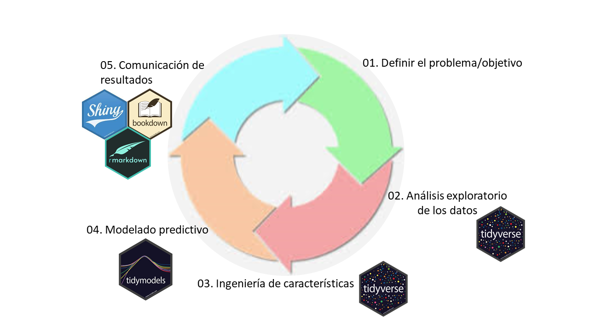
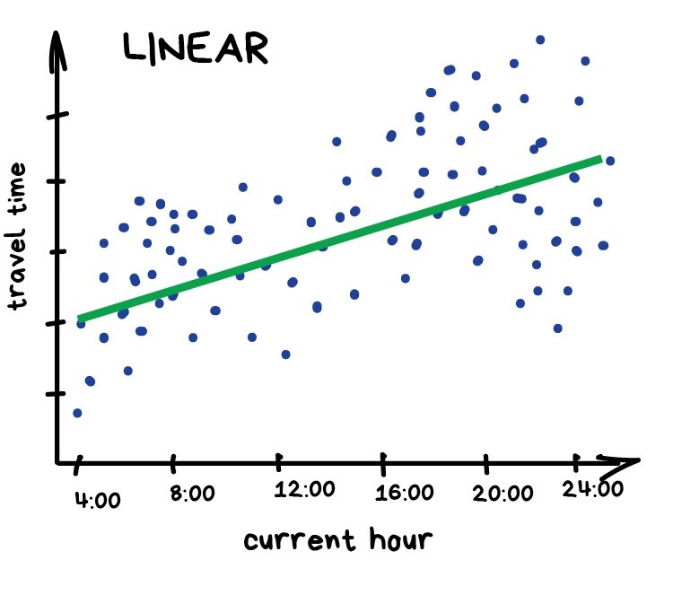
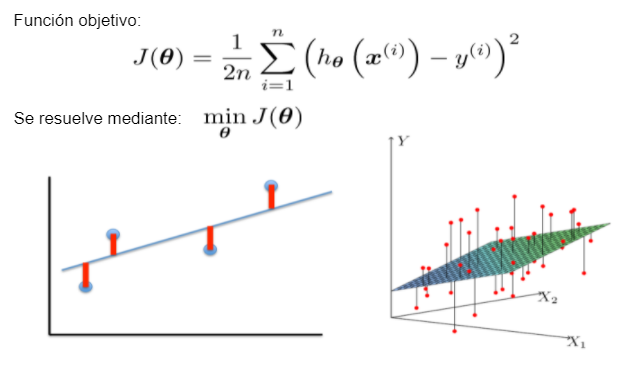
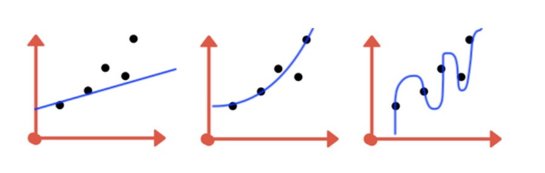
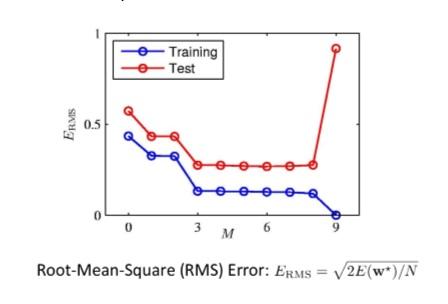
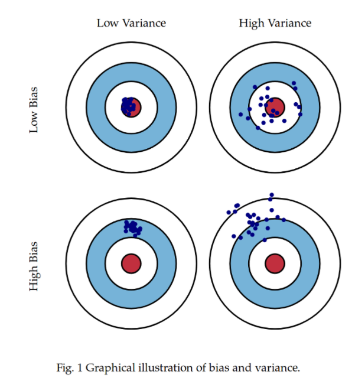
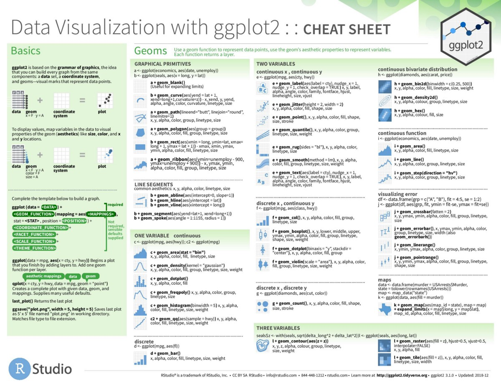
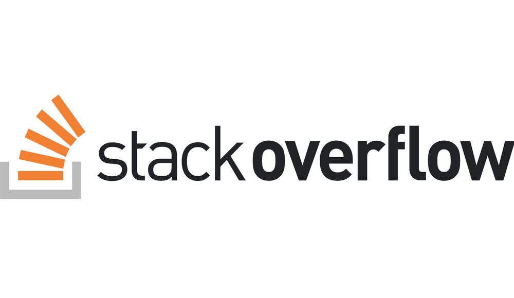
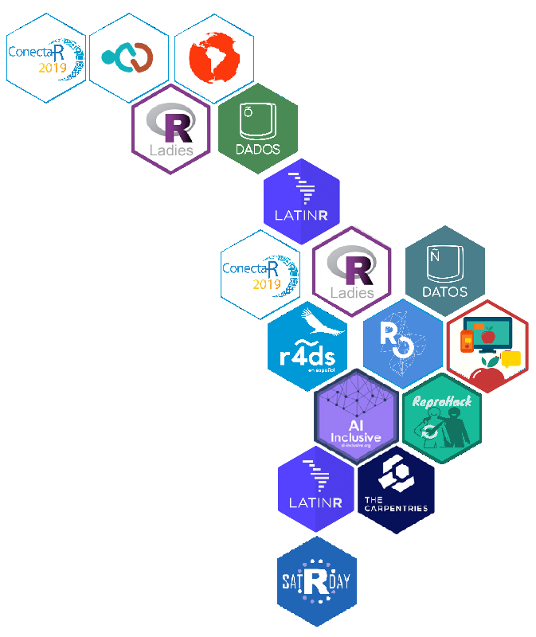

---
output:
   xaringan::moon_reader:
    css: xaringan-themer.css
    lib_dir: libs
    seal: false
    self_contained: true
    nature:
      highlightStyle: github
      highlightLines: false
      countIncrementalSlides: false
      slideNumberFormat: |
        <div class="progress-bar-container">
          <div class="progress-bar" style="width: calc(%current% / %total% * 100%);">
          </div>
        </div>
---

class: title-slide, center, middle
background-image: url(images/portada.jpg)
background-size: cover

#Clase 1: Aprendizaje Supervisado
### Pamela E. Pairo

```{r setup, include = FALSE}
options(htmltools.dir.version = FALSE)
knitr::opts_chunk$set(warning = FALSE)

library(knitr)
library(tidyverse)
# set default options
opts_chunk$set(echo=FALSE,
               collapse = TRUE,
               fig.width = 7.252,
               fig.height = 4,
               dpi = 300)
xaringanExtra::use_tile_view()
xaringanExtra::use_scribble(pen_size = 2)
xaringanExtra::use_clipboard()
xaringanExtra::use_webcam(width = 210, height = 220)
xaringanExtra::use_share_again()
xaringanExtra::use_tachyons()
xaringanExtra::style_share_again(
  share_buttons = c("twitter", "linkedin", "pocket")
)
xaringanExtra::use_panelset()
```

```{r xaringan-extra-styles, include=FALSE}
xaringanExtra::use_extra_styles(
  hover_code_line = TRUE,         #<<
  mute_unhighlighted_code = TRUE  #<<
)
```


```{r include=FALSE}
library(countdown)
```

```{r xaringan-logo, echo=FALSE}

xaringanExtra::use_fit_screen()
xaringanExtra::use_logo(
  image_url = "images/uade.jpg"
)
```

```{r xaringan-themer, include=FALSE, warning=FALSE}
library(xaringanthemer)
style_mono_accent(
  base_color = "#1c5253",
  header_font_google = google_font("Josefin Sans"),
  text_font_google   = google_font("PT Sans", "300", "300i"),
  code_font_google   = google_font("Fira Mono")

)
```

---
class: inverse

## Hoja de Ruta

- Clase 1: Conceptos importantes. Clasificación vs. Regresión. Análisis exploratorio y curación. Ingeniería de features. Sobreajuste. Trade off Sesgo-Varianza. Entrenamiento, evaluación y testeo. Regresión lineal y polinomial. Ejercitación

- Clase 2: Árboles de decisión.Random Forest. SVM. Regresión Logística. Naïve Bayes. Hiperparámetros. Métricas. Ejercitación

- Clase 3: Validación cruzada. Redes neuronales. Selección de modelos. Ejercitación.

- Clase 4: Clustering. K-means. PCA. Embeddings. Ejercitación

- Clase 5: Consideraciones finales. Desbalanceo de clases. Problemas multiclase. Consultas para el trabajo final.

- Clase 6: Presentación de los trabajos finales

---
## Conceptos Importantes `r emo::ji("bulb")`

--

* __Muestra, punto, observación, instancia__ se refiere a una unidad de análisis.

--

* __Atributos, predictores, variables independientes o descriptores__ son los datos de entrada para la ecuación de predicción.

--

* __Salida, variable dependiente, variable respuesta, clase, o "target"__ es la cantidad a ser predicha. 

--

* __Datos categóricos, también conocidos como nominales o atributos__ toman valores específicos que no tienen escala. Ejemplo: bueno/malo, rojo/azul, etc. 

--

* __Datos continuos__ son a base de escalas numéricas. El costo de un producto, la presión sanguínea, etc.

---

## Tipos de Aprendizaje

- **Aprendizaje supervisado**: Datos de entrenamiento + salida esperada

- **Aprendizaje no supervisado**: Datos de entrenamiento (sin salida esperada)

- **Aprendizaje semi-supervisado**: Datos de entrenamiento + pocas salida esperadas

- **Aprendizaje auto-supervisado**: Datos de entrenamiento auto generados (tareas pretexto)

- **Aprendizaje por refuerzo**: "Recompensas" por secuencias de acciones

---
## Tipos de aprendizaje

.center[

]

---

##Regresión vs. Clasificación

.pull-left[Si $y$ $\epsilon$ $R^n$: Entonces es un problema de **regresión**.
]
.pull-right[

]

--

.pull-left[Si $y$ es categórica: Entonces es un problema de **clasificación**.
]

.pull-right[

]
---
class: middle, center

### Regresión vs. Clasificación: Ejemplos

--

Eficiencia de combustible para automóviles

--

Predecir si clientes van a contratar un seguro

--

Predicción de precios de casas según variables geográficas

--

Analisis de sentimientos de noticias financieras (negativo/positivo)

---

## Entrenamiento, validación y testeo


* __Set de entrenamiento__ son los datos utilizados para el modelado. 

* __Set de validación__  ajuste/elección de hiperparámetros

* __Set de testeo__ son los datos utilizados para medir el desempeño del modelo, entre un conjunto de candidatos. 


.center[

]

---

### Ciclo de un proyecto en ciencia de datos

.center[

]

---

class: inverse, middle, center

#📈 📊 `r emo::ji("hammer")`
#Análisis exploratorio de datos y Curación

---

## Análisis exploratorio de datos 🔎

- Distribución de las variables

--

- Outliers o datos atípicos

--
- Presencia de valores faltantes

--

- Desbalance de las clases o grupos en estudio

--

- Análisis de la correlación entre variables

---

# Curación de datos `r emo::ji("hammer")`

- Imputación de datos ruidosos, faltantes o erróneos.

--

- Codificación de variables categóricas.

--

- Transformación de variables.

--

- Ingeniería de outliers.

--

- Escalado de Features

--

- Discretización de variables continuas (ej. edad)

---


##Base de datos del Proyecto Final

.panelset[
.panel[.panel-name[Dataset]

Base de datos pública llamada "Health Insurance Cross Sell Prediction" extraída de [Kaggle](https://www.kaggle.com/anmolkumar/health-insurance-cross-sell-prediction?select=train.csv)


```{r panel-chunk, echo=FALSE}
library(kableExtra)

df <- read.csv("scripts/data/train.csv")

df %>%
head() %>%
  knitr::kable(format = "html")%>%
  kable_styling() %>%
  kableExtra::scroll_box(width = "100%")

```
]

.panel[.panel-name[Variables]

- **id**	único ID para el cliente
- **Gender**	género del cliente
- **Age** Edad del cliente
- **Driving_License**	0 : Cliente no tiene Licencia de Conducir, 1 : Cliente tiene licencia de conducir
- **Previously_Insured**	1 : Cliente tiene seguro de auto, 0 : Cliente no tiene seguro de auto
- **Vehicle_Age**	Edad del vehículo
- **Vehicle_Damage**	1 : El cliente sufrió daños en su vehículo en el pasado 0 : El cliente NO sufrió daños en su vehículo en el pasado
- **Annual_Premium**	La cantidad que el cliente debe pagar como premium en el año.
- **PolicySalesChannel**	Código anónimo para el canal de acercamiento al cliente, es decir. Diferentes agentes, por correo, por teléfono, en persona, etc.
- **Vintage**	Número de días que el cliente ha estado asociado con la empresa
- **Response**	1 : Cliente está interesado, 0 : Cliente no está interesado

]

.panel[.panel-name[Variable Respuesta]

```{r, echo=TRUE, fig.height = 3}

library(ggplot2)
# Basic barplot
g <- ggplot(df, aes(Response))
g + geom_bar()

```

.panel[.panel-name[Age y Gender]

```{r, echo=FALSE, fig.height = 3}

tbl <- with(df, table(Response, Age))
ggplot(as.data.frame(tbl), aes(factor(Age), Freq, fill = Response)) +     
  geom_col()
    
```


]
]
]


---

class: inverse, middle, center

#`r emo::ji("computer")`
###Demo Análisis exploratorio y Curación


---
class: inverse, middle, center

#Aprendizaje Supervisado: Regresión

---
class: inverse, middle, center

## Descanso

```{r}

countdown(minutes = 15, seconds = 0, font_size="7em", color_background = "white")

```

---

## Regresión Lineal

Busca ajustar los datos de entrenamiento a mediante una función que sea un **hiperplano**.


.center[
$y = \theta_0 +\theta_1 x_1+ \theta_2 x_2...+ \theta_d x_d$ $$y = \sum_{j = 0}^{d} \theta_j x_j$$
]

--
.center[

]
---
## Regresión Lineal: Función de Costo

Utilizaremos una función de costo (error cuadrático) para medir el error en la predicción de y mediante f(x). Se busca minimizar la suma del error cuadrático

.center[

]

---
## Regresión Polinomial

Busca ajustar los datos de entrenamiento mediante una **función polinomial**:

.center[
$y (x, w) = w_0 +w_1 x_1+ w_2 x^2...+ w_m x^m$ $$y(x, w) = \sum_{j = 0}^{m} w_j x^j$$
]

--

.center[

]

---
## Sobreajuste o overfitting

.center[

]
--
.center[

]

---
## Sobreajuste o overfitting

.bg-washed-light-purple.b--light-purple.ba.bw2.br3.shadow-5.ph4.mt5[

El sobreajuste ocurre cuando la función de costo es realmente pequeño, pero la generalización del modelo no es confiable. Esto se debe a que el modelo aprende "demasiado" del conjunto de datos de entrenamiento. 

También se dice, que el modelo memoriza los datos de entrenamiento por eso no generalizará bien frente a nuevos datos. Un modelo que sobreajusta, tiene una **alta varianza**

]

---

#Trade-off sesgo-varianza

.center[

]
---
class: center, middle

# `r emo::ji("bulb")`Tener siempre presente `r emo::ji("bulb")`

### El objetivo de un modelo de Machine Learning es que generalice bien frente a nuevos datos o datos no vistos por el modelo (set de testeo)

---

class: inverse, middle, center

#`r emo::ji("computer")`
###Demo Regresión lineal y polinomial

---

## Comunidades y Recursos útiles

.pull-left[

]

.pull-right[


]

.pull-left[


]

.pull-right[


]

---

## Comunidades y Recursos útiles

.pull-left[

]

--

.pull-right[

[10-12 de noviembre LatinR, VIRTUAL](https://latin-r.com/) Talleres y presentaciones orales.


]

---

##Referencias

- [Artículo acerca del Sobreajuste](https://towardsdatascience.com/what-are-overfitting-and-underfitting-in-machine-learning-a96b30864690) en Towards to Data Science

- [Hands-on Machine Learning with R](https://bradleyboehmke.github.io/HOML/DT.html) de Bradley Boehmke y Brandon Greenwell.

- [Tidy Modeling with R](https://www.tmwr.org/index.html) de Max Kuhn y Julia Silge

- [Introducción a Machine Learning con Tidymodels](https://ml-tidy-wibds.netlify.app/material/), workshop dictado en el marco de Women in Bioinformatics & Data Science LA 2021

- [Supervised Machine Learning course](https://supervised-ml-course.netlify.app/) de Julia Silge