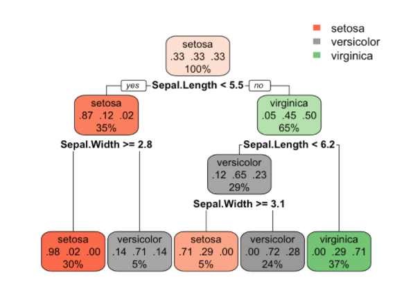
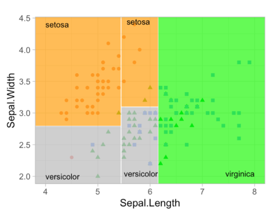

---
output:
   xaringan::moon_reader:
    css: xaringan-themer.css
    lib_dir: libs
    seal: false
    self_contained: true
    nature:
      highlightStyle: github
      highlightLines: false
      countIncrementalSlides: false
      slideNumberFormat: |
        <div class="progress-bar-container">
          <div class="progress-bar" style="width: calc(%current% / %total% * 100%);">
          </div>
        </div>
---

class: title-slide, center, middle
background-image: url(images/portada.jpg)
background-size: cover

#Clase 2: Aprendizaje Supervisado
### Pamela E. Pairo

```{r setup, include = FALSE}
options(htmltools.dir.version = FALSE)
library(knitr)
library(tidyverse)
# set default options
opts_chunk$set(echo=FALSE,
               collapse = TRUE,
               fig.width = 7.252,
               fig.height = 4,
               dpi = 300)
xaringanExtra::use_tile_view()
xaringanExtra::use_clipboard()
xaringanExtra::use_webcam(width = 210, height = 220)
xaringanExtra::use_share_again()
xaringanExtra::use_tachyons()
xaringanExtra::style_share_again(
  share_buttons = c("twitter", "linkedin", "pocket")
)
xaringanExtra::use_panelset()
```

```{r xaringan-extra-styles, include=FALSE}
xaringanExtra::use_extra_styles(
  hover_code_line = TRUE,         #<<
  mute_unhighlighted_code = TRUE  #<<
)
```


```{r include=FALSE}
library(countdown)
```

```{r xaringan-logo, echo=FALSE}

xaringanExtra::use_fit_screen()
xaringanExtra::use_logo(
  image_url = "images/uade.jpg"
)
```

```{r xaringan-themer, include=FALSE, warning=FALSE}
library(xaringanthemer)
style_mono_accent(
  base_color = "#1c5253",
  header_font_google = google_font("Josefin Sans"),
  text_font_google   = google_font("PT Sans", "300", "300i"),
  code_font_google   = google_font("Fira Mono")

)
```

---

class: inverse, middle, center

#Aprendizaje Supervisado: Árboles de decisión

---

## Árboles de decisión

Se quiere predecir 3 especies de _Iris_ a partir del ancho y largo del sépalo: _Iris setosa_, _Iris versicolor_ y _Iris virginica_.

--

.pull-left[

]

--

.pull-right[

]

---

## Hiperparámetro

.bg-washed-light-purple.b--light-purple.ba.bw2.br3.shadow-5.ph4.mt5[
Valores no aprendidos por el algoritmo desde los datos y por ende deben ser seteados antes de entrenar el algoritmo.

]

--

### En árboles de decisión:

- `n_min` : n mínimo para dividir los nodos

- `tree_depth`: límite a la profundidad del árbol

- `cost_complexity`: costo o penalización a los errores de árboles más complejos. Es una forma de poda.
---
class: inverse, middle, center

#`r emo::ji("computer")`
###Demo Árboles de decisión

