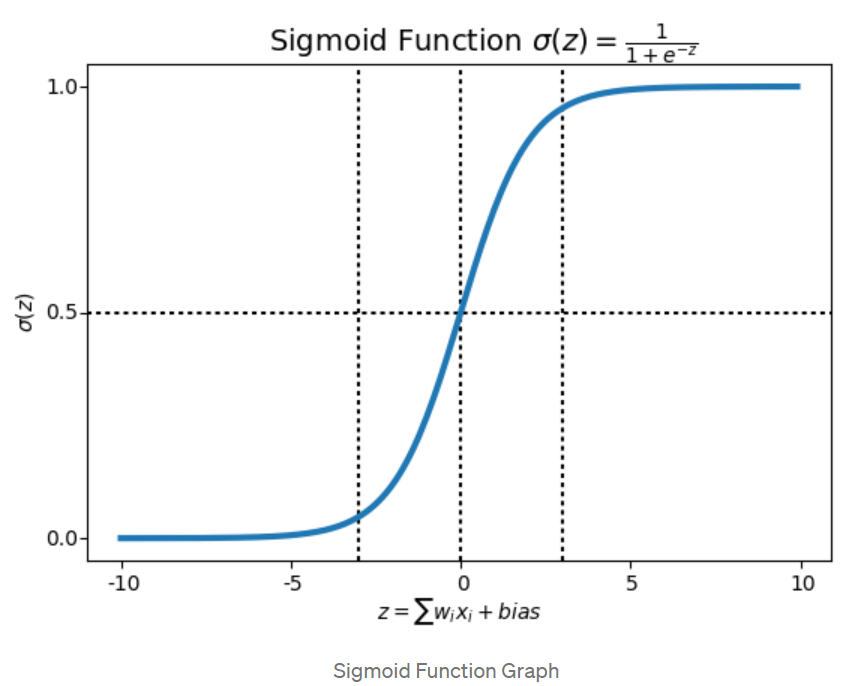
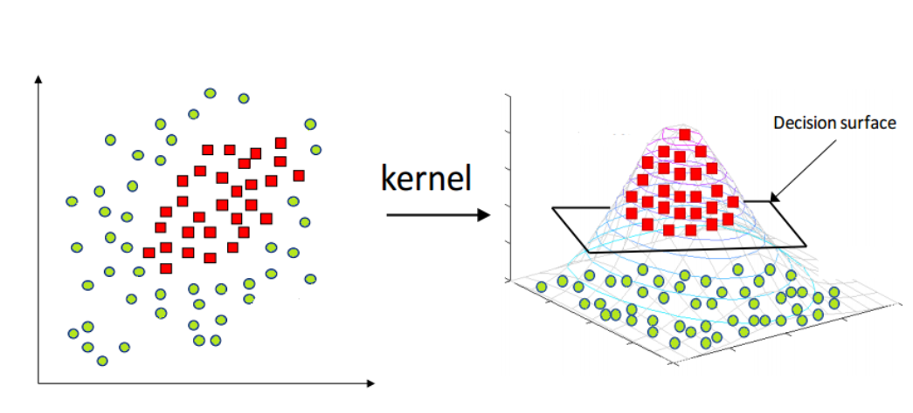

---
output:
   xaringan::moon_reader:
    css: xaringan-themer.css
    lib_dir: libs
    seal: false
    self_contained: true
    nature:
      highlightStyle: github
      highlightLines: false
      countIncrementalSlides: false
---

class: title-slide, center, middle
background-image: url(images/portada.jpg)
background-size: cover

#Clase 2: Aprendizaje Supervisado
### Pamela E. Pairo

```{r setup, include = FALSE}
options(htmltools.dir.version = FALSE)
library(knitr)
library(tidyverse)
# set default options
opts_chunk$set(echo=FALSE,
               collapse = TRUE,
               fig.width = 7.252,
               fig.height = 4,
               dpi = 300)
xaringanExtra::use_tile_view()
xaringanExtra::use_clipboard()
xaringanExtra::use_webcam(width = 210, height = 220)
xaringanExtra::use_share_again()
xaringanExtra::use_tachyons()
xaringanExtra::style_share_again(
  share_buttons = c("twitter", "linkedin", "pocket")
)
xaringanExtra::use_panelset()
```

```{r xaringan-extra-styles, include=FALSE}
xaringanExtra::use_extra_styles(
  hover_code_line = TRUE,         #<<
  mute_unhighlighted_code = TRUE  #<<
)
```


```{r xaringan-logo, echo=FALSE}

xaringanExtra::use_fit_screen()
xaringanExtra::use_logo(
  image_url = "images/uade.jpg"
)
```

```{r xaringan-themer, include=FALSE, warning=FALSE}
library(xaringanthemer)
style_mono_accent(
  base_color = "#1c5253",
  header_font_google = google_font("Josefin Sans"),
  text_font_google   = google_font("PT Sans", "300", "300i"),
  code_font_google   = google_font("Fira Mono")

)

colors = c(
  red = "#f34213",
  purple = "#3e2f5b",
  orange = "#ff8811",
  green = "#136f63",
  white = "#FFFFFF"
)
```

---
# En la clase de hoy...

--

### En la primera parte:

- Regresión Logística 
- Naïve Bayes
- Support Vector Machine (SVM)
- Árboles de decisión
- Random Forest 

 

--

### **.orange[Recreo]** `r emo::ji("coffee")`🧉

--

### En la segunda parte:

- Métricas

---

class: inverse, middle, center

#Regresión Logística

---

#Regresión Logística

Utiliza un **.purple[enfoque probabilístico]**

.center[

]


.center[

]

---
# Regresión Logística

Se define un umbral (en este caso 0.5):

.center[

Se predice  $y= 1$ si $h_{\theta}(x) \ge 0.5$

Se predice  $y= 0$ si $h_{\theta}(x) < 0.5$


]

.footnote[Extraído del material didáctico de Cristian Cardellino]
---

## Regresión Logística: Función de Costo

.center[


]

---
class: inverse, middle, center

# Naive Bayes

---

# Teorema de Bayes

.bg-washed-light-purple.b--light-purple.ba.bw2.br2.shadow-5.ph3.mt2[
.center[
$\LARGE P(A|B)= \frac{P(B|A) * P(A)}{P(B)}$
]
]

El teorema establece que se puede encontrar la probabilidad de **A** (e.g. una clase objetivo) dada la ocurrencia de B (e.g. un conjunto de features). Es decir, B es la evidencia y A es la hipótesis.

--

_.orange[Dada nuestras variables predictoras, 쯖uál es la probabilidad de cada clase?
]_

.center[
$\ P(Clase|Predictores)= \LARGE \frac{P(Predictores|Clase) * P(Clase)}{P(Predictores)}$

$\LARGE = \frac{Prior * Likelihood}{Evidencia}$

$\ Predictores= \LARGE (x_1, x_2, x_3...x_n)$
]

---

#쯇orqué Naive?

La principal asunción es que **.purple[los atributos son independientes entre sí.]**

Una segunda asunción, es que **.purple[todos los atributos tienen el mismo efecto en la salida del algoritmo.]**

###Entonces...

.center[
$\ P(y|x_1, x_2..x_n)= \LARGE \frac{P(x_1|y) * P(x_n|y)...P(x_1|y)* P(y)}{P(x_1)* P(x_2)...P(x_N)}$
]

---

class: inverse, middle, center

# Support Vector Machine (SVM)

---
# SVM

.bg-washed-light-purple.b--light-purple.ba.bw2.br2.shadow-5.ph2.mt2[

El algoritmo de **SVM** encuentra el hiperplano que devuelve el **mayor margen** entre sí mismo y los vectores de soporte

]

.pull-left[]

.pull-right[]

---
# SVM

.center[]

.footnote[Imagen extraída de [este link](https://www.javatpoint.com/machine-learning-support-vector-machine-algorithm)]
---

### SVM para datos NO linealmente separables

Se debe proyectar a una dimensión donde los datos si sean linealmente separables

.center[]

**.orange[Tipo de kernels]**: lineal, polinomial, RBF.

.footnote[Imagen extraída de [este link](https://medium.com/analytics-vidhya/how-to-classify-non-linear-data-to-linear-data-bb2df1a6b781)]
---
class: inverse, middle, center

# Árboles de decisión

---

## Árboles de decisión

Funcionan bien para datos no linealmente separables.

Se quiere predecir 3 especies de _Iris_ a partir del ancho y largo del sépalo: _Iris setosa_, _Iris versicolor_ y _Iris virginica_.

--

.pull-left[

]

--

.pull-right[

]

---
# Sobreajuste en los Árboles de Decisión

.bg-washed-light-purple.b--light-purple.ba.bw2.br2.shadow-5.ph2.mt2[

- El error de entrenamiento es siempre cero 

- Poca capacidad de generalización.
]
---

## Hiperparámetro

.bg-washed-light-purple.b--light-purple.ba.bw2.br3.shadow-5.ph4.mt5[
Valores no aprendidos por el algoritmo desde los datos y por ende deben ser seteados antes de entrenar el algoritmo.

]

--

### En árboles de decisión:

- `n_min` : n mínimo para dividir los nodos

- `tree_depth`: límite a la profundidad del árbol

- `cost_complexity`: costo o penalización a los errores de árboles más complejos. Es una forma de poda.

---

# Ensamble learning: Bagging

Los **.orange[árboles de decisión]** son algoritmos inestables debido a que pequeñas variaciones en el dataset pueden generar modelos muy diferentes.
--

.bg-washed-light-purple.b--light-purple.ba.bw2.br3.shadow-5.ph4.mt4[
**.orange[Bagging (Bootstrap Aggregation)]** es un método para hacer aprendizaje por _ensemble_.

Consiste en realizar K subsets del dataset aleatoriamente y con reemplazo, resultando en un _ensamble_ de K modelos. La asignación de la clase se realiza por mayoria simple en casos de clasificación.

]

---
class: inverse, middle, center

# Random Forest
---
# Random Forest

Son una modificación a Bagging para Árboles de Decisión. En cada árbol se consideran sólo M atributos elegidos aleatoriamente.

El algoritmo es sencillo, fácil de implementar, fácil de usar y requiere de poco ajuste de parámetros.

.center[

]
---
class: inverse, middle, center

#`r emo::ji("computer")`
###Demo Modelos

---
class: inverse, middle, center

## Descanso `r emo::ji("party")` `r emo::ji("coffee")`🧉

```{r}

library(countdown)
countdown(minutes = 15, seconds = 0, font_size="7em", color_background = "white")

```

---
class: inverse, middle, center

#Métricas

---

#El conjunto de test

Durante el proceso de aprendizaje, el modelo **.orange[no debe acceder]** bajo ninguna circunstancia a los datos del conjunto de testeo, sino las estimaciones estarán **.orange[sesgadas].**

El conjunto de validación se utiliza para ajustar los hiperparámetros y luego se hace la selección de modelos.

Las métricas ayudan a capturar objetivos reales en forma cuantitativa (no todos los errores son iguales)

.center[

]

---

#Matriz de Confusión

Se quiere que los elementos diagonales tengan valores grandes y los no diagonales valores chicos

.center[

]
---
#Accuracy

.center[
$\LARGE Accuracy = \frac{TP + TN}{TP+TN+FP+FN}$
]

.center[

]

--

No es adecuado cuando los datos están **.purple[muy desbalanceados.]** Le da mayor importancia a la clase mayoritaria.
---
#Precision

.center[
$\LARGE Precision = \frac{TP}{TP+FP}$
]

.center[

]

---
#Recall (Sensitividad)

Encuentra todos los positivos

.center[
$\LARGE Recall = \frac{TP}{TP+FN}$
]

.center[

]

---
#F1 Score

Medida armónica entre Precision y recall

.center[
$\LARGE F1 = 2* \frac{precision * recall}{precision + recall}$
]

#Especificidad

.center[
$\LARGE Especificidad = \frac{TN}{TN + FP}$
]
---
#Curvas ROC

Puedo comparar modelos

AUC= área bajo la curva ROC, que también sirve para comparar modelos.

.center[

]
---
# Referencias

- [Introduction to Logistic Regression](https://towardsdatascience.com/introduction-to-logistic-regression-66248243c148), artículo publicado en Towards to Data Science

- [Applied Machine Learning](https://rstudio-conf-2020.github.io/applied-ml/Part_6.html#1) dictado en rstudio::conf 2020

- [20 Popular Machine Learning Metrics. Part 1: Classification & Regression Evaluation Metrics](https://towardsdatascience.com/20-popular-machine-learning-metrics-part-1-classification-regression-evaluation-metrics-1ca3e282a2ce)

- [Data preprocessing and resampling using tidymodels](https://www.youtube.com/watch?v=s3TkvZM60iU&ab_channel=JuliaSilge), tutorial en Youtube de Julia Silge