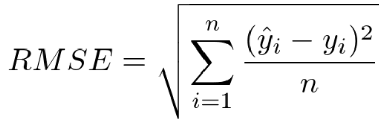
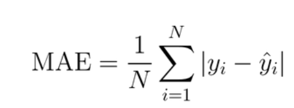
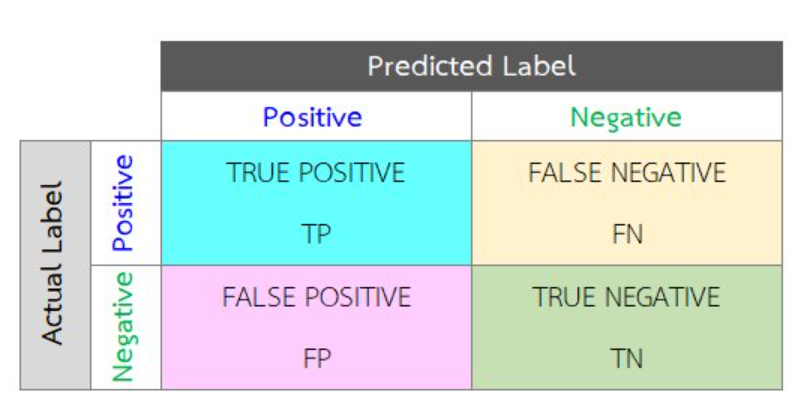

---
output:
   xaringan::moon_reader:
    css: xaringan-themer.css
    lib_dir: libs
    seal: false
    self_contained: true
    nature:
      highlightStyle: github
      highlightLines: false
      countIncrementalSlides: false
---

class: title-slide, center, middle
background-image: url(images/portada.jpg)
background-size: cover

#Clase 3: Aprendizaje Supervisado
### Pamela E. Pairo

```{r setup, include = FALSE}
options(htmltools.dir.version = FALSE)
library(knitr)
library(tidyverse)
# set default options
opts_chunk$set(echo=FALSE,
               collapse = TRUE,
               fig.width = 7.252,
               fig.height = 4,
               dpi = 300)
xaringanExtra::use_tile_view()
xaringanExtra::use_clipboard()
xaringanExtra::use_scribble(pen_size = 2)
xaringanExtra::use_webcam(width = 210, height = 220)
xaringanExtra::use_share_again()
xaringanExtra::use_tachyons()
xaringanExtra::style_share_again(
  share_buttons = c("twitter", "linkedin", "pocket")
)
xaringanExtra::use_panelset()
```

```{r xaringan-extra-styles, include=FALSE}
xaringanExtra::use_extra_styles(
  hover_code_line = TRUE,         #<<
  mute_unhighlighted_code = TRUE  #<<
)
```


```{r xaringan-logo, echo=FALSE}

xaringanExtra::use_fit_screen()
xaringanExtra::use_logo(
  image_url = "images/uade.jpg"
)
```

```{r xaringan-themer, include=FALSE, warning=FALSE}
library(xaringanthemer)
style_mono_accent(
  base_color = "#1c5253",
  header_font_google = google_font("Josefin Sans"),
  text_font_google   = google_font("Open Sans", "400", "300i"),
  code_font_google   = google_font("Fira Mono")

)

colors = c(
  red = "#f34213",
  purple = "#3e2f5b",
  orange = "#ff8811",
  green = "#136f63",
  white = "#FFFFFF"
)
```

---

class: middle, center
# En la clase de hoy...

--

### En la primera parte:

Técnicas de resampling

Métricas

--

### **.orange[Recreo]** `r emo::ji("coffee")`🧉

--

Práctica en R.

---

## Conjunto de testeo

Durante el proceso de aprendizaje, el modelo **.orange[no debe acceder]** bajo ninguna circunstancia a los datos del conjunto de testeo, sino las estimaciones estarán **.orange[sesgadas].**

.center[

]


.bg-washed-light-purple.b--light-purple.ba.bw2.br2.shadow-5.ph3.mt2[
El objetivo de un modelo de Machine Learning es que generalice bien frente a nuevos datos o datos no vistos por el modelo (set de testeo)
]

---
# Conjunto de validación

El conjunto de validación se utiliza para ajustar los hiperparámetros y luego se hace la selección de modelos.

Importante para evitar el overfitting y obtener modelos estables.

1- Selección de hiperparámetros

2- Selección de modelos usando el conjunto de validación

3- Encontrar la mejor configuración de hiperparámetros según la métrica elegida

4- Evaluación final con el conjunto de testeo

---
# Muestreo estratificado

.center[

]
---
# Cross-validation

.center[

]
---
class: inverse, middle, center

#Métricas

---

#El conjunto de test

Las métricas ayudan a capturar objetivos reales en forma cuantitativa (no todos los errores son iguales)

.center[

]
---
#Métricas para Regresión

**.orange[Mean Square Error (MSE)]**

.center[

]

**.orange[Root Mean Square Error (RMSE)]**

.center[

]

**.orange[Mean Absolute Error (MAE)]**

.center[

]

---

### Métricas para Clasificación: Matriz de Confusión

Se quiere que los elementos diagonales tengan valores grandes y los no diagonales valores chicos

.center[

]
---
#Accuracy

.center[
$\LARGE Accuracy = \frac{TP + TN}{TP+TN+FP+FN}$
]

.center[

]

--

No es adecuado cuando los datos están **.purple[muy desbalanceados.]** Le da mayor importancia a la clase mayoritaria.
---
#Precision

.center[
$\LARGE Precision = \frac{TP}{TP+FP}$
]

.center[

]

---
#Recall (Sensitividad)

Encuentra todos los positivos

.center[
$\LARGE Recall = \frac{TP}{TP+FN}$
]

.center[

]

---
#F1 Score

Medida armónica entre Precision y recall

.center[
$\LARGE F1 = 2* \frac{precision * recall}{precision + recall}$
]

#Especificidad

.center[
$\LARGE Especificidad = \frac{TN}{TN + FP}$
]
---
#Curvas ROC

Puedo comparar modelos

AUC= área bajo la curva ROC, que también sirve para comparar modelos.

.center[

]

---
class: inverse, middle, center

## Descanso `r emo::ji("party")` `r emo::ji("coffee")`🧉

```{r}

library(countdown)
countdown(minutes = 15, seconds = 0, font_size="7em", color_background = "white")

```

---

class: inverse, middle, center

#`r emo::ji("computer")`
#Manos a R!!
---
# Referencias

- [20 Popular Machine Learning Metrics. Part 1: Classification & Regression Evaluation Metrics](https://towardsdatascience.com/20-popular-machine-learning-metrics-part-1-classification-regression-evaluation-metrics-1ca3e282a2ce)

- [Aprendizaje Automático y las Métricas de Regresión](https://sitiobigdata.com/2018/08/27/machine-learning-metricas-regresion-mse/#)