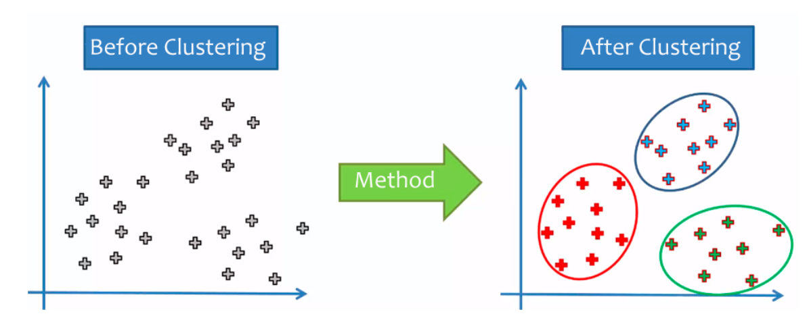
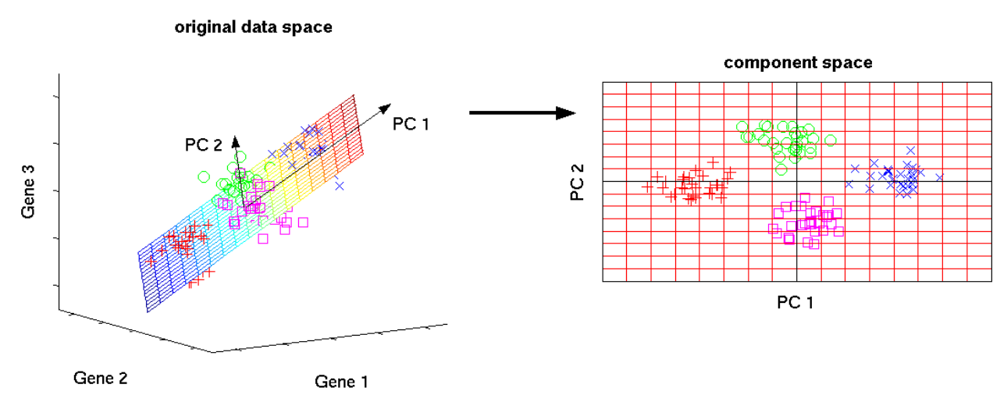

---
output:
   xaringan::moon_reader:
    css: xaringan-themer.css
    lib_dir: libs
    seal: false
    self_contained: true
    nature:
      highlightStyle: github
      highlightLines: false
      countIncrementalSlides: false
---

class: title-slide, center, middle
background-image: url(images/portada.jpg)
background-size: cover

#Clase 4: Aprendizaje No Supervisado
### Pamela E. Pairo

```{r setup, include = FALSE}
options(htmltools.dir.version = FALSE)
library(knitr)
library(tidyverse)
# set default options
opts_chunk$set(echo=FALSE,
               collapse = TRUE,
               fig.width = 7.252,
               fig.height = 4,
               dpi = 300)
xaringanExtra::use_tile_view()
xaringanExtra::use_clipboard()
xaringanExtra::use_scribble(pen_size = 2)
xaringanExtra::use_webcam(width = 210, height = 220)
xaringanExtra::use_share_again()
xaringanExtra::use_tachyons()
xaringanExtra::style_share_again(
  share_buttons = c("twitter", "linkedin", "pocket")
)
xaringanExtra::use_panelset()
```

```{r xaringan-extra-styles, include=FALSE}
xaringanExtra::use_extra_styles(
  hover_code_line = TRUE,         #<<
  mute_unhighlighted_code = TRUE  #<<
)
```


```{r xaringan-logo, echo=FALSE}

xaringanExtra::use_fit_screen()
xaringanExtra::use_logo(
  image_url = "images/uade.jpg"
)
```

```{r xaringan-themer, include=FALSE, warning=FALSE}
library(xaringanthemer)
style_mono_accent(
  base_color = "#1c5253",
  header_font_google = google_font("Josefin Sans"),
  text_font_google   = google_font("Open Sans", "400", "300i"),
  code_font_google   = google_font("Fira Mono")

)

colors = c(
  red = "#f34213",
  purple = "#3e2f5b",
  orange = "#ff8811",
  green = "#136f63",
  white = "#FFFFFF"
)
```

---

class: middle, center
# En la clase de hoy...

--

### En la primera parte:

¿Qué es el Aprendizaje No Supervisado?

Kmeans

PCA

T-SNE

--

### **.orange[Recreo]** `r emo::ji("coffee")`🧉

--

Práctica en R.

---

## ¿De qué se trata?

.bg-washed-light-purple.b--light-purple.ba.bw2.br2.shadow-5.ph3.mt2[
En el aprendizaje no supervisado, no se proporcionan etiquetas y el algoritmo de aprendizaje se centra únicamente en detectar la estructura en los datos de entrada.
]

- **.orange[Clustering]**: se busca encontrar agrupamientos o clusters dentro del dataset no etiquetado.

- **.orange[Reducción de dimensionalidad]**: se busca es identificar patrones en las características de los datos. La reducción de dimensionalidad se utiliza a menudo para facilitar la visualización de los datos, así como un método de preprocesamiento antes del aprendizaje supervisado.

---
# ¿De qué se trata?

.center[

]

.center[

]

.center[
.footnote[Imagenes extraidas de [aqui](https://programmerclick.com/article/90051499108/)]
]
---
# ¿Para qué?

- Para conocer el dataset

- Refinamiento de clases 

.bg-washed-light-purple.b--light-purple.ba.bw2.br2.shadow-5.ph3.mt2[

Los resultados dependen de las variables explicatorias utilizadas por lo que cobra importancia .orange[el análisis exploratorio de datos y la curación.]

Resulta importante el aporte de un/una experto/a de dominio para explicar los posibles agrupamientos y la elección de las variables relevantes.

Se itera varias veces
]

---
# Posibles aplicaciones

- **.purple[Marketing]**: encontrar grupos de clientes con un comportamiento similar dada una gran base de datos de clientes que contienen sus propiedades y registros de compras anteriores.

--

- **.purple[Biología]**: definición de especies de plantas y animales dadas sus características.

--

- **.purple[Seguro]**: identificar fraudes.

--

- **.purple[Detección de comunidades]**
