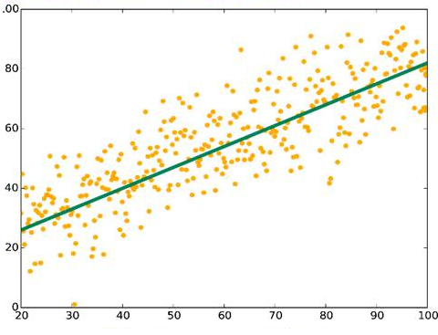
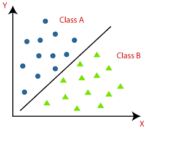
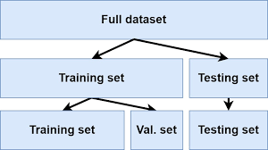

---
output:
   xaringan::moon_reader:
    css: xaringan-themer.css
    lib_dir: libs
    seal: false
    self_contained: true
    nature:
      highlightStyle: github
      highlightLines: false
      countIncrementalSlides: false
---

class: title-slide, center, middle
background-image: url(images/portada.jpg)
background-size: cover

#Clase 6: Repaso
### Pamela E. Pairo

```{r setup, include = FALSE}
options(htmltools.dir.version = FALSE)
library(knitr)
library(tidyverse)
# set default options
opts_chunk$set(echo=FALSE,
               collapse = TRUE,
               fig.width = 7.252,
               fig.height = 4,
               dpi = 300)
xaringanExtra::use_tile_view()
xaringanExtra::use_clipboard()
xaringanExtra::use_scribble(pen_size = 2)
xaringanExtra::use_webcam(width = 210, height = 220)
xaringanExtra::use_share_again()
xaringanExtra::use_tachyons()
xaringanExtra::style_share_again(
  share_buttons = c("twitter", "linkedin", "pocket")
)
xaringanExtra::use_panelset()
```

```{r xaringan-extra-styles, include=FALSE}
xaringanExtra::use_extra_styles(
  hover_code_line = TRUE,         #<<
  mute_unhighlighted_code = TRUE  #<<
)
```


```{r xaringan-logo, echo=FALSE}

xaringanExtra::use_fit_screen()
xaringanExtra::use_logo(
  image_url = "images/uade.jpg"
)
```

```{r xaringan-themer, include=FALSE, warning=FALSE}
library(xaringanthemer)
style_mono_accent(
  base_color = "#1c5253",
  header_font_google = google_font("Josefin Sans"),
  text_font_google   = google_font("Open Sans", "400", "300i"),
  code_font_google   = google_font("Fira Mono")

)

colors = c(
  red = "#f34213",
  purple = "#3e2f5b",
  orange = "#ff8811",
  green = "#136f63",
  white = "#FFFFFF"
)
```

---

class: inverse

## Hoja de Ruta

- Clase 1: Conceptos importantes. Clasificación vs. Regresión. Análisis exploratorio y curación. Ingeniería de features. Sobreajuste. Trade off Sesgo-Varianza. Entrenamiento, evaluación y testeo. Regresión lineal y polinomial. Ejercitación

- Clase 2: Árboles de decisión.Random Forest. SVM. Regresión Logística. Naïve Bayes. Hiperparámetros. Ejercitación

- Clase 3: Validación cruzada. Métricas. Selección de modelos. Ejercitación.

- Clase 4: Clustering. K-means. PCA. Embeddings. Ejercitación

- Clase 5: Consideraciones finales. Desbalanceo de clases. Problemas multiclase. Consultas para el trabajo final.

---
## Tipos de aprendizaje

.center[

]

---
### Ciclo de un proyecto en ciencia de datos

.center[

]

---
class: inverse, middle, center

# 1. Definir el problema/objetivo

---
### Definir el Objetivo

¿Qué variable se quiere predecir? 
¿De qué datos se dispone o se requiere conseguir mas datos?  

###Regresión vs. Clasificación

.pull-left[**.purple[Regresión]**
]

.pull-right[
**.purple[Clasificación]**
]

.pull-left[


]

.pull-right[

]

---
class: inverse, middle, center

#📈 📊 `r emo::ji("hammer")`
# 2. Análisis exploratorio de datos y Curación

---
## La importancia de conocer la base de datos

.bg-washed-light-purple.b--light-purple.ba.bw2.br2.shadow-5.ph3.mt2[

¿Qué variables están disponibles?
¿Qué distribución tienen?
¿Cómo se relacionan las distintas variables?

]

- Distribución de las variables (Normal, $\chi^2$, binomial, etc)

- Outliers o datos atípicos (boxplots, diagrama de violín, evaluar residuos)

- Presencia de valores faltantes (evaluar la distribución de los NAs)

- Desbalance de las clases o grupos en estudio

- Análisis de la correlación entre variables (ej. matriz de correlación)

---
class: inverse, middle, center

# 3. Ingeniería de features

---

#Ingeniería de features

.pull-left[

- Imputación de datos ruidosos, faltantes o erróneos.
- Codificación de variables categóricas.
- Transformación de variables.
- Ingeniería de outliers.
- Escalado de Features
- Discretización de variables continuas

]

.pull-right[


]


```{r, echo=TRUE, warning = FALSE}
library(tidymodels)

rec <-recipe (Response ~ ., data= df_train) %>% 
              step_scale(all_numeric_predictors(), -all_outcomes())%>%
              step_dummy(all_nominal_predictors()) %>% 
              prep()
```

---
class: inverse, middle, center

# 3. Modelado Predictivo

---
# Algoritmos vistos

.pull-left[
### Aprendizaje Supervisado

- Regresión Lineal y polinomial
- Árboles de decisión
- Random Forest
- Support Vector Machine (SVM)
- Regresión Logística
- Naïve Bayes

.center[]
]

--

.pull-right[

###Aprendizaje No Supervisado

- K-means
- PCA
- TSNE

```{r, echo=TRUE, warning = FALSE}
library(Rtsne) #Tsne
library(factoextra)#PCA

```
]
---

## Conjuntos de validación y testeo

.bg-washed-light-purple.b--light-purple.ba.bw2.br2.shadow-5.ph3.mt3[
El objetivo de un modelo de Machine Learning es que generalice bien frente a nuevos datos o datos no vistos por el modelo (set de testeo)
]

.center[]

**.orange[Conjunto de validación]** nos sirve para hacer el tuneo de **.orange[hiperparámetros]** y la selección de modelos.

**.orange[Conjunto de testeo]** se utiliza para medir la performance del modelo mediante **.orange[métricas]**

.right[
Imagen extraída de [aquí](https://www.machinecurve.com/index.php/2020/11/16/how-to-easily-create-a-train-test-split-for-your-machine-learning-model/#train-test-split-for-a-multilabel-dataset)
]

---
#Métricas

.pull-left[

###Regresión

- Mean Square Error (MSE)

- Root Mean Square Error (RMSE)

- Mean Absolute Error (MAE)

.center[]
]

.pull-right[

###Clasificación

- Matriz de Confusión

- Accuracy

- Precision

- Recall

- F1

- Curvas ROC y AUC
]